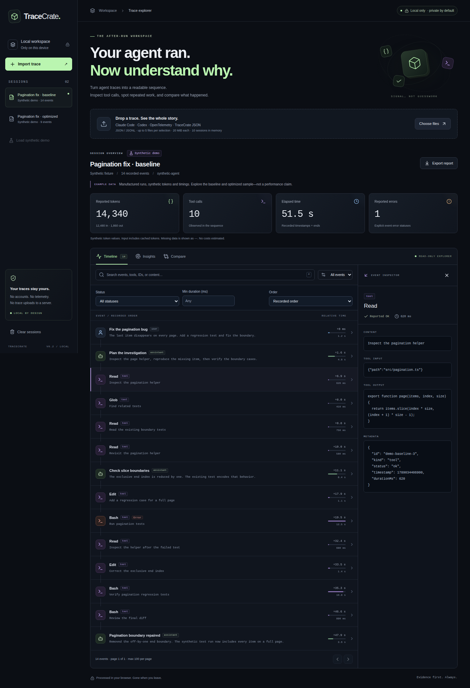

# TraceCrate — Your agent ran. Read what happened.

**A privacy-first, client-side AI trace workbench. Inspect the sequence, question the patterns, share deliberately.**

[](https://github.com/FankChen/tracecrate/actions/workflows/ci.yml)
[](https://github.com/FankChen/tracecrate/actions/workflows/pages.yml)
[](https://github.com/FankChen/tracecrate/releases/tag/v0.2.0)

[简体中文](README.zh-CN.md) · [V0.2 research & design](docs/v0.2-design.md) · [Format guide](docs/formats.md) · [Privacy](docs/privacy.md) · [Contributing](CONTRIBUTING.md)



*Actual V0.2 live-site screenshot from [Pages 34747767675](https://github.com/FankChen/tracecrate/actions/runs/34747767675), visually reviewed; 1440 × 2104 full page. All events and values are synthetic demo data, not benchmark results.*

TraceCrate turns files you choose into a searchable timeline, recorded metrics, heuristic diagnostics, and side-by-side comparisons. No backend, no telemetry, no accounts, no API keys. It reads traces; it does not run agents or execute recorded commands.

**[Open the live demo](https://fankchen.github.io/tracecrate/)** · **[v0.2.0 release & downloads](https://github.com/FankChen/tracecrate/releases/tag/v0.2.0)** · **[Contribute](CONTRIBUTING.md)** · [Source on GitHub](https://github.com/FankChen/tracecrate). Explore synthetic runs without installing anything, or run locally below.

## Try the story in 30 seconds

Open the [hosted demo](https://fankchen.github.io/tracecrate/) and follow the walkthrough below. Local use requires **Node.js ≥22.12 (24 recommended)** and npm:

```sh
git clone https://github.com/FankChen/tracecrate.git
cd tracecrate
npm ci
npm run dev
```

For local use, open the address printed by Vite. Installation time is separate from the 30-second walkthrough:

1. **0–10s:** The two synthetic pagination runs load automatically. Open a tool event in **Timeline**; search or filter by event kind.
2. **10–20s:** Open **Insights**, then **Compare** to inspect recorded differences. “Baseline” and “optimized” are manufactured demo labels, not measured improvements.
3. **20–30s:** Choose **Export report → Structure only → Show redacted preview**, then download JSON or a standalone HTML report. Review the full download before sharing.

No Claude/Codex installation or agent commands are necessary. For your own data, use **Choose files** or drop a supported file. Claude session files are private: explicitly select only files you are authorized to inspect; TraceCrate never scans agent directories. Never contribute actual histories as fixtures.

## What you can do

- **Focus on the recorded evidence:** literal search across text/IDs/models, combined kind/status/minimum-duration filters, stable longest-first or recorded ordering, tool inputs/outputs and metadata; 100 events per page.
- **Read evidence, not invented certainty:** reported tokens, explicit errors, elapsed time when present; missing values stay unknown. No cost estimates.
- **Spot patterns:** explicit tool errors, long tool durations, large outputs, and identical name/input repetitions. Heuristics do not establish causes or intent.
- **Compare two sessions:** recorded metric differences (B − A), tool-call counts and event-by-event kind/name alignment, changed field labels, tools-only/differences-only filters and links to either original event. Repeated names can align ambiguously; descriptive, not a controlled benchmark.
- **Share with a deliberate boundary:** strict structure-only by default, now with optional timing/token removal; best-effort pattern redaction remains separate. HTML has no scripts or external assets; native JSON can be reimported. Removed values stay unknown, not zero.
- **Keep the workflow local:** file reading/parsing in Web Workers, sessions in memory, ordinal import progress, independent cancellation and a 30-second per-file deadline. Cancel discards the pending batch but keeps existing sessions; Clear removes them. Reload restores demos; downloaded files remain on disk.

### V0.2 walkthrough

1. In **Timeline**, select **Reported error** or set **Min duration (ms)**, then choose **Longest first**. Missing duration is excluded when a minimum is set—even zero.
2. In **Compare**, scroll to **Event-by-event comparison**. Inspect changed fields or choose **Tools only**; an event button opens the original session and correct timeline page.
3. In **Export report → Structure only**, optionally select **Omit timing metadata** and/or **Omit token usage**, preview, then inspect the full download. Switching to patterns clears minimization because free text may contain the same metadata.

See the [design decisions and official references](docs/v0.2-design.md), [V0.2 release notes](docs/releases/v0.2.0.md) and [keyboard walkthrough](docs/keyboard.md).

## Format support — subsets, not universal ingestion

| Format | Supported input | Important boundary |
| --- | --- | --- |
| Claude Code | Normal message JSONL; text, tool calls/results, selected system/result records | Partial streaming deltas ignored; private transcript variants can differ |
| Codex | Rollout JSONL with `session_meta`, `turn_context`, `response_item`, selected `event_msg` | Not arbitrary `codex exec --json` events; reasoning/deltas not imported |
| OTLP JSON | `resourceSpans → scopeSpans → spans`, nested structured attributes, current/legacy cache-write keys | No protobuf, collector endpoint, full OTLP, or MCP transcript support |
| TraceCrate native | One validated `schemaVersion: 1` JSON report | Bounded schema; unknown fields stripped; JSON exports are sharing transforms, not raw backups |

See [formats, synthetic examples, and public upstream references](docs/formats.md). `Usage.input` **includes** `cacheRead` and `cacheWrite`; those are subcounts, not additions. Total reported tokens = input + output.

**Limits:** 20 MiB UTF-8 per file, 20,000 input records and normalized events, nesting depth 60; up to 5 files per selection and 10 sessions in memory (including demos). Imports have a 30-second per-file deadline; background timer throttling can delay enforcement. Web Workers required; whole-file parsing, not streaming. Sequence alignment permits 2,000 selected events per side, 400 edits and a 200 ms budget, with explicit failure rather than partial output. Analysis, comparison and exports still use the UI thread. Detail/preview rendering is capped at 50,000 characters, not the full download. See [architecture](docs/architecture.md).

## Privacy is a boundary, not a guarantee

The app has no trace-upload or telemetry path. That does **not** make every environment or export safe. Browser extensions, a compromised browser/device, and modified hosted code can read data. A static host still receives ordinary request metadata, such as IP address and user agent.

**Structure-only removes arbitrary free text**, original identifiers/names, inputs, outputs, and model names using a strict allowlist. Token usage and timing remain by default and can now be omitted; event order, counts, remapped relationships and statuses still remain and can be sensitive. **Pattern redaction preserves text and can miss secrets.** Neither mode guarantees anonymization; inspect every field of the full download. Clearing memory is not secure erasure. Read [privacy and export details](docs/privacy.md) and [security reporting](SECURITY.md).

## Development & publication status

`npm run check` runs lint, unit tests, browser-test typechecking and the production build. `npm run test:e2e` invokes Playwright; browser binaries must be installed separately. `npm run package:release` packages an already-tested build with licenses and SHA-256 checksums. See [contribution checks](CONTRIBUTING.md).

**V0.2 released · 2026-09-13:** [v0.2.0](https://github.com/FankChen/tracecrate/releases/tag/v0.2.0) targets `dc5d92daabe84378d994f09637db317f36b21024`. Its [release validation job](https://github.com/FankChen/tracecrate/actions/runs/34748718079) passed **225 unit tests and all 64 browser tests**, lint, application/browser TypeScript, build, coverage and dependency audit. Core/adapters line coverage is 97.51% (not UI coverage). Publication was recovered from an HTTP 500 using the unchanged validated artifact; the overall workflow remains marked failed, not passed. Both public downloads were independently verified against SHA-256 and the original artifact. [Pages 34747767675](https://github.com/FankChen/tracecrate/actions/runs/34747767675) separately verified the hosted app at `a95b96c1459b7454f88e5efb4d76af780ed1c661`, with the same application assets: offline import, filters/comparison, exports and zero runtime network/console errors. See [full provenance and recovery details](docs/verification.md).

**Historical first release · 2026-09-10:** [v0.1.0](https://github.com/FankChen/tracecrate/releases/tag/v0.1.0) was created at `52d9ae9b73f815c264a3eb39f5fc3eedc5cb9715`; its 107 unit / 36 browser tests and 96.58% core/adapters line coverage are historical, not substituted for V0.2 checks.

**Verification limits:** Chromium desktop and Pixel 7 emulation run in GitHub Actions; local browser downloads remain blocked. This is not physical-device, Firefox/WebKit or screen-reader certification. Launch posts and the interaction video are **not published**. See [verification history](docs/verification.md).

- [CI workflow](.github/workflows/ci.yml) — Node 24, checks, Chromium E2E.
- [Manual Pages workflow](.github/workflows/pages.yml) — default branch only; enable Pages → GitHub Actions, then dispatch manually. [Publication checklist](docs/release.md).
- [Manual Release workflow](.github/workflows/release.yml) — default branch only; reruns checks/audit/browser tests, packages the tested static site and publishes a new version without replacing existing tags.
- [Open contribution tasks and roadmap](docs/roadmap.md) · [Organic launch plan and draft copy](docs/launch-plan.md) · [Changelog](CHANGELOG.md).

Original TraceCrate project; not affiliated with or endorsed by Anthropic, OpenAI, or OpenTelemetry. [MIT license](LICENSE), copyright 2026 TraceCrate contributors.
