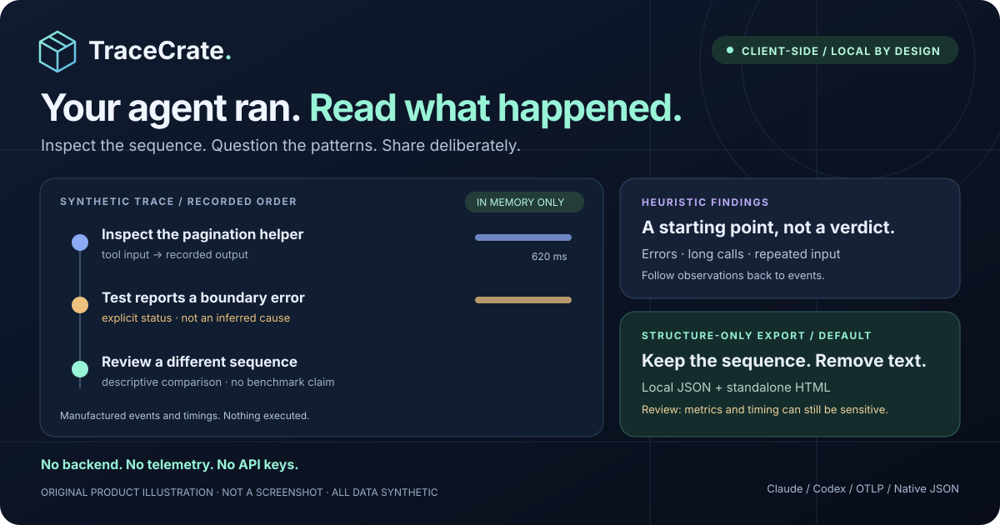

# TraceCrate — Your agent ran. Read what happened.

**A privacy-first, client-side AI trace workbench. Inspect the sequence, question the patterns, share deliberately.**

[简体中文](README.zh-CN.md) · [Format guide](docs/formats.md) · [Privacy](docs/privacy.md) · [Contributing](CONTRIBUTING.md)



*Original product illustration, not a screenshot. All illustrated events and values are synthetic.*

TraceCrate turns files you choose into a searchable timeline, recorded metrics, heuristic diagnostics, and side-by-side comparisons. No backend, no telemetry, no accounts, no API keys. It reads traces; it does not run agents or execute recorded commands.

**Hosted demo pending publication.** Run locally below; no live demo or published release is claimed.

## Try the story in 30 seconds

Requires **Node.js ≥22.12 (24 recommended)** and npm:

```sh
git clone https://github.com/FankChen/tracecrate.git
cd tracecrate
npm ci
npm run dev
```

Open the local address printed by Vite. Installation time is separate from the 30-second walkthrough:

1. **0–10s:** The two synthetic pagination runs load automatically. Open a tool event in **Timeline**; search or filter by event kind.
2. **10–20s:** Open **Insights**, then **Compare** to inspect recorded differences. “Baseline” and “optimized” are manufactured demo labels, not measured improvements.
3. **20–30s:** Choose **Export report → Structure only → Show redacted preview**, then download JSON or a standalone HTML report. Review the full download before sharing.

No Claude/Codex installation or agent commands are necessary. For your own data, use **Choose files** or drop a supported file. Claude session files are private: explicitly select only files you are authorized to inspect; TraceCrate never scans agent directories. Never contribute actual histories as fixtures.

## What you can do

- **Follow the recorded sequence:** search, event-kind filters, relative times, tool inputs/outputs, and metadata; 100 events per page.
- **Read evidence, not invented certainty:** reported tokens, explicit errors, elapsed time when present; missing values stay unknown. No cost estimates.
- **Spot patterns:** explicit tool errors, long tool durations, large outputs, and identical name/input repetitions. Heuristics do not establish causes or intent.
- **Compare two sessions:** recorded metric differences (B − A) and tool-call counts. Descriptive, not a controlled benchmark.
- **Share with a deliberate boundary:** strict structure-only export by default; optional best-effort pattern redaction. HTML reports have no scripts or external assets; native JSON can be reimported.
- **Keep the workflow local:** file reading/parsing in Web Workers, sessions in memory, clear-session cancellation. Reload discards imported sessions and restores the demo; downloaded files remain on disk.

## Format support — subsets, not universal ingestion

| Format | Supported input | Important boundary |
| --- | --- | --- |
| Claude Code | Normal message JSONL; text, tool calls/results, selected system/result records | Partial streaming deltas ignored; private transcript variants can differ |
| Codex | Rollout JSONL with `session_meta`, `turn_context`, `response_item`, selected `event_msg` | Not arbitrary `codex exec --json` events; reasoning/deltas not imported |
| OTLP JSON | `resourceSpans → scopeSpans → spans`, selected GenAI attributes | No protobuf, collector endpoint, full OTLP, or MCP transcript support |
| TraceCrate native | One validated `schemaVersion: 1` JSON report | Bounded schema; unknown fields stripped; JSON exports are sharing transforms, not raw backups |

See [formats, synthetic examples, and public upstream references](docs/formats.md). `Usage.input` **includes** `cacheRead` and `cacheWrite`; those are subcounts, not additions. Total reported tokens = input + output.

**Limits:** 20 MiB UTF-8 per file, 20,000 input records and normalized events, nesting depth 60; up to 5 files per selection and 10 sessions in memory (including demos). Web Worker support required. Imports read whole files, not streaming; exports and analysis still use the UI thread. Detail/preview rendering is capped at 50,000 characters, not the full downloaded report. See [architecture](docs/architecture.md).

## Privacy is a boundary, not a guarantee

The app has no trace-upload or telemetry path. That does **not** make every environment or export safe. Browser extensions, a compromised browser/device, and modified hosted code can read data. A static host still receives ordinary request metadata, such as IP address and user agent.

**Structure-only removes arbitrary free text**, original identifiers/names, inputs, outputs, and model names using a strict allowlist. Event relationships, statuses, token metrics, and timestamps/durations remain—and can still be sensitive. **Pattern redaction preserves text and can miss secrets.** Neither mode guarantees anonymization; inspect every field of the full download. Clearing memory is not secure erasure. Read [privacy and export details](docs/privacy.md) and [security reporting](SECURITY.md).

## Development & publication status

`npm run check` runs lint, unit tests, and the production build. `npm run test:e2e` invokes Playwright; browser binaries must be installed separately. See [contribution checks](CONTRIBUTING.md).

**Validation:** local lint, 107 unit tests and the production build pass; core/adapters line coverage is 96.58% (not UI coverage). Browser tests run on GitHub because local browser downloads are blocked. Check the [current CI run](https://github.com/FankChen/tracecrate/actions/workflows/ci.yml) and [verification record](docs/verification.md) for the browser result.

- [CI workflow](.github/workflows/ci.yml) — Node 24, checks, Chromium E2E.
- [Manual Pages workflow](.github/workflows/pages.yml) — default branch only; enable Pages → GitHub Actions, then dispatch manually. [Publication checklist](docs/release.md).
- [Roadmap issue seeds](docs/roadmap.md) · [Organic launch plan and draft copy](docs/launch-plan.md) · [Changelog](CHANGELOG.md).

Original TraceCrate project; not affiliated with or endorsed by Anthropic, OpenAI, or OpenTelemetry. [MIT license](LICENSE), copyright 2026 TraceCrate contributors.
